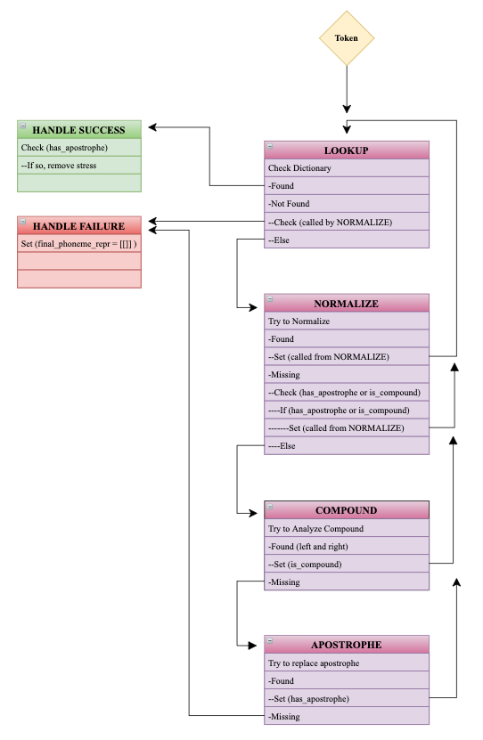
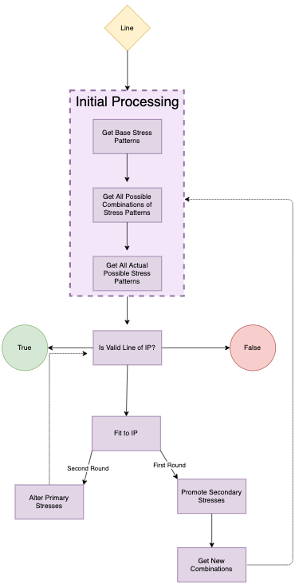

# Iambic Pentameter Period Classifier

## Overview
The application should be able to take an IP text as input and output the period to which it belongs.

## Components
- Tokenizer
- Spelling
- Compounds

### Dictionary Lookup Finite State Machine

### Iambic Line Processor

notes:
-use "difficulty measure" as a feature: how many rules on average have to be applied to a sample?
-words per line
-avg, max, min syllables per line
-% of words found in cmudict
-rules applied vs.  (any other feature)
